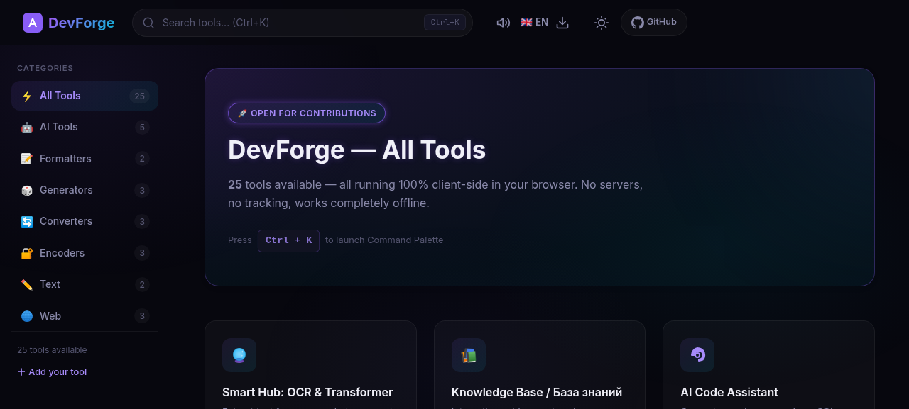
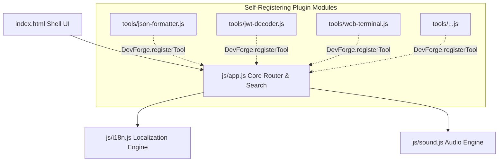

<div align="center">

# ⚒️ DevForge

### A beautiful, open-source developer toolkit — built by the community, for the community.

**25+ essential developer & AI-agent tools. Zero dependencies. Runs entirely in your browser.**

[](LICENSE)
[](CONTRIBUTING.md)
[](manifest.json)
[](js/i18n.js)
[](sw.js)
[](https://gewitter89.github.io/devforge/)

<br>

[](https://gewitter89.github.io/devforge/)

<br>

> [!IMPORTANT]
>
> ### 📢 WE ARE BUILDING THIS TOGETHER! / МЫ ПИШЕМ ЭТОТ ПРОЕКТ ВМЕСТЕ!
>
> **English**: DevForge is a 100% community-driven project. We want this to be the ultimate developer toolkit. Adding a new tool takes less than 15 minutes! Check our [Contributing Guide](CONTRIBUTING.md) and send your PRs. Let's build something awesome together! 🚀
>
> **Русский**: DevForge — это проект, создаваемый сообществом. Мы хотим сделать идеальный набор инструментов для разработчиков. Добавить новую утилиту можно меньше чем за 15 минут! Читай [Руководство по участию](CONTRIBUTING.md) и отправляй свои Pull Request-ы. Давай сделаем крутой инструмент вместе! 🤝

<br>

[**🌐 Live Demo**](https://gewitter89.github.io/devforge/) · [**🐛 Report a Bug**](https://github.com/gewitter89/devforge/issues/new?template=bug_report.yml) · [**✨ Request a Feature**](https://github.com/gewitter89/devforge/issues/new?template=feature_request.yml) · [**🔧 Propose a Tool**](https://github.com/gewitter89/devforge/issues/new?template=new_tool.yml) · [**🌱 Good First Issues**](https://github.com/gewitter89/devforge/issues?q=is%3Aissue+is%3Aopen+label%3A%22good+first+issue%22)

</div>

## 🤔 What is DevForge?

DevForge is a **Swiss Army knife for developers and AI-agent builders** — a sleek, modular web app packed with everyday utilities. No installs, no sign-ups, no telemetry. Just open it and get stuff done.

- ⚡ **Blazing fast** — everything runs client-side, nothing leaves your browser
- 🤖 **AI-agent focused** — unique tools for prompt engineering, LLM routing, and agent configs
- 🎨 **Beautiful UI** — dark/light themes, responsive layout, smooth animations
- 🧩 **Modular architecture** — each tool is a single self-registering JS file
- 🔌 **Zero dependencies** — built with vanilla HTML, CSS, and JavaScript
- 🌍 **Works offline** — installable PWA, use it without internet
- 🗣️ **14 languages** — EN, RU, UK, ZH, JA, KO, ES, PT, DE, FR, IT, PL, AR, HI
- 🔒 **Private by design** — your data never touches a server
- 🤝 **Easy to contribute** — add a tool in under 15 minutes

---

## 🛠️ Available Tools (25)

### 🤖 AI & Agent Tools — our specialty

| Tool                             | Description                                                        |
| -------------------------------- | ------------------------------------------------------------------ |
| **AI Code Assistant**            | Generate regex, SQL schemas, or explain code using LLMs            |
| **AI Context Packager**          | Combine multiple source files into a single LLM prompt block       |
| **AI Prompt Sanitizer**          | Strip hidden Unicode characters and audit prompts for jailbreaks   |
| **AI Agent Config Hub**          | Generate ready-to-use configs for popular AI coding agents         |
| **OpenCode Config Generator**    | Build OpenCode configurations visually                             |
| **Multi-Provider LLM Router**    | Compare LLM responses from multiple providers in parallel          |
| **LLM Quality Monitor**          | Real-time tracking of LLM model degradation and quality metrics    |
| **Knowledge Base**               | Curated guides: free LLM APIs, token compression, agent sandboxing |
| **Smart Hub: OCR & Transformer** | Extract text from images and transform data locally                |

### 🧰 Everyday Developer Tools

| Tool                       | Category   | Description                                                     |
| -------------------------- | ---------- | --------------------------------------------------------------- |
| **JSON Formatter**         | Formatters | Format, validate, minify, and syntax-highlight JSON             |
| **Markdown Preview**       | Formatters | Live Markdown editor with instant HTML preview                  |
| **Base64 Encoder/Decoder** | Encoders   | Encode and decode Base64 with UTF-8 support                     |
| **URL Encoder/Decoder**    | Encoders   | Encode/decode URLs, parse into components, build query strings  |
| **JWT Decoder**            | Encoders   | Parse and inspect JWT payloads and expiration dates             |
| **Hash Generator**         | Generators | MD5, SHA-1, SHA-256, SHA-384, SHA-512 hashes instantly          |
| **UUID Generator**         | Generators | Cryptographically secure UUID v4 and v7 — single or bulk        |
| **Password Generator**     | Generators | Strong passwords with strength analysis                         |
| **Color Converter**        | Converters | HEX ↔ RGB ↔ HSL ↔ HSV with live preview                         |
| **Timestamp Converter**    | Converters | Unix timestamps ↔ human dates with live clock                   |
| **Diff Checker**           | Text       | Side-by-side and inline text comparison                         |
| **Lorem Ipsum Generator**  | Text       | Placeholder text with formatting options                        |
| **Cron Parser**            | Web        | Translate crontab schedules to readable text and execution list |
| **Image Optimizer**        | Web        | Compress, resize, convert images — 100% locally                 |
| **Visual Web Terminal**    | Web        | Use DevForge tools through a simulated Unix terminal            |
| **Breach Checker**         | Security   | Check emails/domains against known data breaches (HIBP)         |

> 💡 **Want to see a new tool?** [Propose one here!](https://github.com/gewitter89/devforge/issues/new?template=new_tool.yml)

---

## 📚 Guides & AI Hacks / База знаний и ИИ-гиды

We maintain a structured, community-updated knowledge base of agentic coding hacks, cost-saving configurations, and integrations.
Мы поддерживаем структурированную базу знаний с хаками для ИИ-агентов, инструкциями по экономии токенов и интеграциям.

👉 **[Explore Full Knowledge Base / Открыть базу знаний (docs.md)](docs.md)**

- 🚀 **[GIG AI Boost (EN/RU)](docs/guides/gig-ai-boost.md)** — Private repositories, MCP servers, and agent configurations.
- 🪨 **[Caveman SKILLS (EN/RU)](docs/guides/caveman.md)** — Prompt token compression guide (save ~65% tokens).
- 🔑 **[Free LLM APIs (EN/RU)](docs/guides/free-llm-apis.md)** — Permanent free API keys for developers.
- 🔌 **[ClinePass Setup (EN/RU)](docs/guides/cline-pass.md)** — Custom OpenAI-compatible configurations.
- 🐳 **[CLI in Docker (EN/RU)](docs/guides/cli-in-docker.md)** — Sandboxing your AI agent inside Docker.
- 🤖 **[TelePI Telegram Bot (EN/RU)](docs/guides/telepi.md)** — Run your PI CLI through a Telegram bot.
- 🎛️ **[Herdr Multiplexer (EN/RU)](docs/guides/herdr.md)** — Tmux for AI coding agents.

---

## ⚡ Quick Start

DevForge requires **no build step**, no Node.js, no bundler. Just a browser.

### Option 1 — Open directly

```bash
git clone https://github.com/gewitter89/devforge.git
cd devforge
# Open index.html in your browser — that's it!
```

### Option 2 — Local dev server (recommended for development)

```bash
git clone https://github.com/gewitter89/devforge.git
cd devforge
npx serve .
# → http://localhost:3000
```

### Option 3 — GitHub Pages

Visit the live version at **[gewitter89.github.io/devforge](https://gewitter89.github.io/devforge/)**

---

## 🤝 Contributing

We love contributions! DevForge is designed to make contributing **ridiculously easy**. Whether you're a first-time contributor or an experienced developer, there's a place for you.

👉 Read the full **[Contributing Guide](CONTRIBUTING.md)** for detailed instructions.
👉 Browse **[good first issues](https://github.com/gewitter89/devforge/issues?q=is%3Aissue+is%3Aopen+label%3A%22good+first+issue%22)** to get started in minutes.

**Every merged PR puts your avatar on the [Contributors Wall](https://gewitter89.github.io/devforge/) on the live site.**

### How to add a new tool — 3 simple steps

**Step 1:** Copy the template

```bash
cp templates/tool-template.js tools/my-awesome-tool.js
```

**Step 2:** Implement your tool using the `DevForge.registerTool()` API

```js
DevForge.registerTool({
  id: 'my-awesome-tool',
  name: 'My Awesome Tool',
  description: 'What it does in one sentence',
  category: 'converters', // formatters | generators | converters | encoders | text | web | ai
  icon: '<svg>...</svg>', // 24x24 SVG icon
  tags: ['awesome', 'cool'],
  render() {
    return `<div class="tool-full"><!-- Your UI here --></div>`;
  },
  init() {
    // Attach event listeners here
  }
});
```

**Step 3:** Add a `<script>` tag to `index.html`

That's it. Open a PR. 🎉

### Other easy ways to contribute

- 🌍 **Translate** — add or improve one of the 14 language files in [`i18n/`](i18n/)
- 📝 **Write a guide** — share an AI-agent hack in [`docs/guides/`](docs/guides/)
- 🐛 **Report bugs** — even a screenshot helps

---

## 🏗️ How it Works (Architecture)

DevForge is built with a highly decoupled, plugin-based architecture using vanilla technologies.



```
devforge/
├── index.html              # Single-page shell
├── css/                    # Themes, layout, components
├── js/                     # Core: registration, routing, search, i18n, sound
├── tools/                  # Each tool = one self-registering file (25 and counting)
├── i18n/                   # 14 language files
├── docs/guides/            # AI-agent knowledge base
├── templates/              # Starter template for new tools
├── tests/                  # Smoke tests
└── .github/                # CI, issue templates, PR template
```

Each tool calls `DevForge.registerTool()` — the core automatically adds it to the catalog, search, and routing. **Zero configuration.**

---

## 🗺️ Roadmap

- [x] 🤖 **AI Code Assistant** — built-in Llama / Gemini / OpenAI support
- [x] 🔊 **Audio UI feedback** — gentle synth clicks and success chords
- [x] 🎨 **Interactive Contributors Wall** — dynamic widget loading GitHub profiles
- [x] 📱 **PWA support** — install DevForge as a desktop/mobile app
- [x] 🌐 **i18n / Localization** — 14 languages supported
- [x] ⌨️ **Command Palette** — Ctrl+K power-user navigation
- [x] 🔍 **JWT decoder & cron parser** — shipped!
- [ ] 🧪 **Regex Tester** — [help wanted!](https://github.com/gewitter89/devforge/issues)
- [ ] 📄 **YAML ⇄ JSON Converter** — [help wanted!](https://github.com/gewitter89/devforge/issues)
- [ ] 📱 **QR Code Generator** — [help wanted!](https://github.com/gewitter89/devforge/issues)
- [ ] 📦 **Tool favorites** — bookmark your most-used tools
- [ ] 🎨 **Custom themes** — community-created color schemes

> Have an idea? [Open a feature request!](https://github.com/gewitter89/devforge/issues/new?template=feature_request.yml)

---

## 📜 License

This project is licensed under the **MIT License** — see the [LICENSE](LICENSE) file for details.

You're free to use, modify, and distribute DevForge. Attribution appreciated but not required. ❤️

---

## 💖 Contributors

Thanks to these amazing people for building DevForge:

<!-- ALL-CONTRIBUTORS-LIST:START -->
<!-- prettier-ignore-start -->
<!-- markdownlint-disable -->

<!-- markdownlint-restore -->
<!-- prettier-ignore-end -->
<!-- ALL-CONTRIBUTORS-LIST:END -->

Want to see your avatar here? Check out the **[Contributing Guide](CONTRIBUTING.md)** and submit a PR!

---

<div align="center">

**If DevForge helps you, consider giving it a ⭐ — it helps others discover the project!**

Made with ❤️ by the open-source community

</div>
