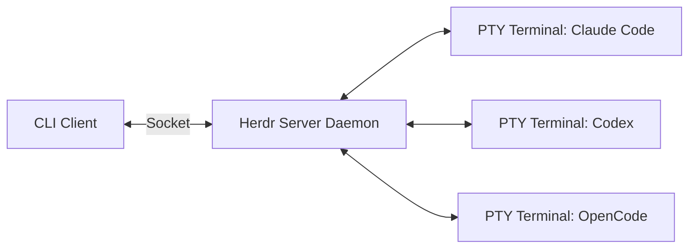

# 🐙 Herdr — Мультиплексор для AI-агентов (Как tmux, только для кодинг-ботов)

[Herdr Repository](https://github.com/ogulcancelik/herdr) — это специализированный инструмент для управления параллельными сессиями автономных ИИ-разработчиков и CLI-агентов в рамках единого терминального интерфейса.

---

## 💡 Основные возможности

1. **🖥️ Настоящий терминал для каждого агента**
   * Никаких эмуляций. Выделяется полноценный pty-терминал. Полноэкранные текстовые интерфейсы (TUI), интерактивные утилиты и редакторы работают так же стабильно, как в обычном окружении.
2. **📊 Боковая панель статусов**
   * Мгновенный визуальный мониторинг состояния каждого ИИ-агента:
     * `Running` (Работает)
     * `Blocked` (Заблокирован — ожидает подтверждения пользователя)
     * `Completed` (Завершил выполнение)
     * `Idle` (Бездействует)
3. **🖱️ Рабочие пространства и управление мышью**
   * Полноценная поддержка вкладок, панелей и оконных разделений (split-screens). Возможность изменять размеры областей, перетаскивать и кликать мышкой непосредственно внутри терминала.
4. **🔌 Живучесть сессий (Background Server)**
   * Фоновый сервер хранит состояние запущенных CLI-агентов. При закрытии терминала, сбое SSH-подключения или перезагрузке клиента все процессы продолжают выполняться в фоне. После переподключения вы возвращаетесь в ту же точку.
5. **📦 Легковесность и отсутствие зависимостей**
   * Поставляется в виде одного скомпилированного бинарного файла (~10 МБ). Работает на Linux, macOS и Windows (экспериментальная поддержка). Подходит для удаленной работы по SSH.
6. **🤖 API и CLI для оркестрации**
   * Локальный Socket API позволяет агентам взаимодействовать друг с другом и управлять внешними сессиями. Можно строить цепочки: когда Агент 1 завершает задачу, срабатывает триггер и CLI автоматически запускает Агента 2.

---

## 🛠️ Архитектура Herdr

---

## ❓ Кому это нужно?

* **Параллельная разработка**: если вы ведете одновременно несколько задач в разных ветках или репозиториях с помощью независимых агентов.
* **Удаленный кодинг**: при запуске тяжелых сессий ИИ-кодинга на серверах, где стабильность соединения критична.
* **Координация систем**: если вы строите распределенные пайплайны сборки и хотите подружить Claude Code, Codex, Hermes и другие инструменты в одной цепочке.
